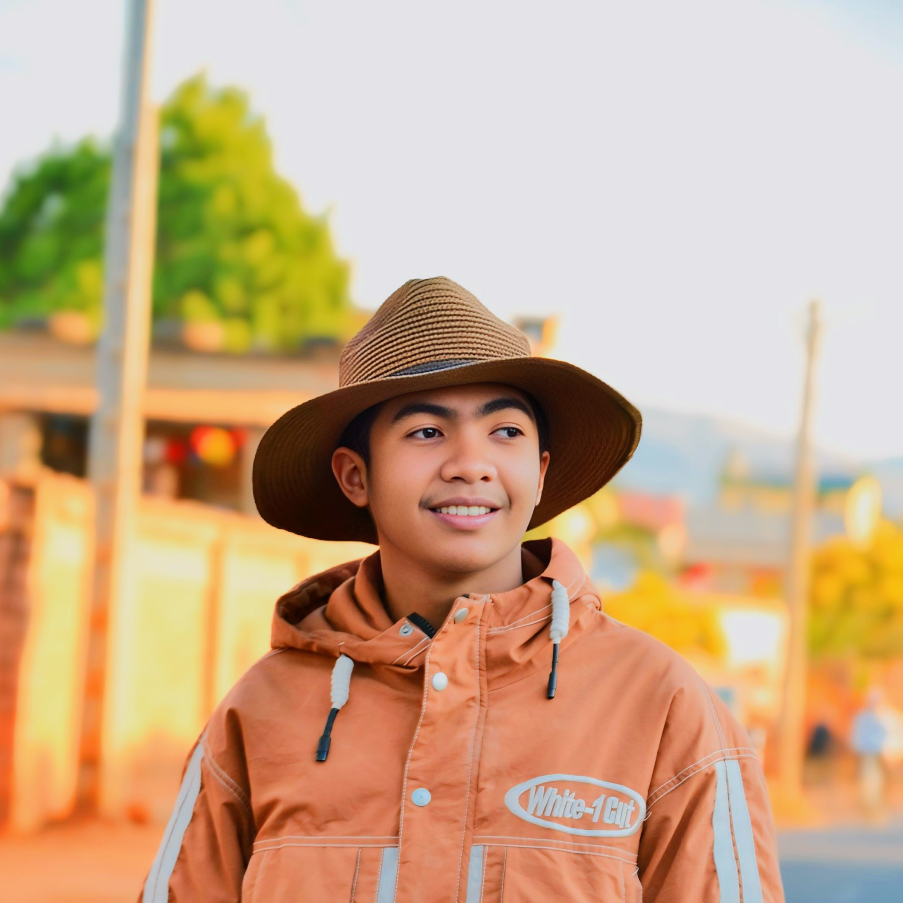

# 🌐 Portfolio — ROGATIANA

> Portfolio personnel de **ROGATIANA**, développeur web front-end junior basé à Fianarantsoa, Madagascar.

Un site web moderne, responsive et animé, réalisé en **HTML5**, **CSS3** et **JavaScript** vanilla — sans framework ni dépendance lourde.

---

## 📸 Aperçu



---

## ✨ Fonctionnalités

- 🎨 **Design moderne** avec animations fluides
- 🌓 **Thème clair / sombre** persistant (localStorage)
- 📱 **100 % responsive** — mobile, tablette, desktop
- ⚡ **Rapide et léger** — aucun framework
- 🎭 **Animations CSS** : blobs, particules, reveal au scroll, typing effect
- ✉️ **Formulaire de contact** fonctionnel avec Web3Forms
- 🛡️ **Anti-spam** (honeypot) intégré
- ♿ **Accessibilité** (a11y) — ARIA, `prefers-reduced-motion`
- 🚀 **Performance** — `requestAnimationFrame`, lazy loading, throttle

---

## 🛠️ Technologies utilisées

| Technologie | Utilisation |
|-------------|-------------|
| **HTML5** | Structure sémantique |
| **CSS3** | Mise en page (Flexbox, Grid), animations, variables CSS |
| **JavaScript (ES6+)** | Interactions, validation, animations dynamiques |
| **Font Awesome 6** | Icônes |
| **Google Fonts** | Inter & Space Grotesk |
| **Web3Forms** | Envoi du formulaire de contact |
| **GitHub Pages** | Hébergement |

---

## 🚀 Démo en ligne

🔗 **[Voir le portfolio](https://rogatiana.github.io/portfolio_dvp_web)**

---

## 📦 Installation locale

### 1. Cloner le dépôt

```bash
git clone https://github.com/ROGATIANA/portfolio_dvp_web.git
cd portfolio_dvp_web
```

### 2. Lancer un serveur local

**Option A — Python** (recommandé) :

```bash
python -m http.server 8000
```

Puis ouvre `http://localhost:8000`

**Option B — Node.js** :

```bash
npx serve
```

**Option C — VS Code** :

Installe l'extension **Live Server** ou **Live Server++**, puis clic droit sur `index.html` → **"Open with Live Server"** ou **"Open with Live Server++"**.

> ⚠️ **Important** : n'ouvre pas `index.html` en double-cliquant dessus (`file://`). Le favicon et le formulaire ne fonctionneront pas correctement.

---

## 📈 Améliorations futures

- [ ] Ajouter un blog
- [ ] Intégrer un système de projets dynamiques (JSON)
- [ ] Multi-langue (FR / EN / MG)
- [ ] Optimisation SEO avancée
- [ ] PWA (Progressive Web App)

---

## 👤 Auteur

**ROGATIANA**

- 🎓 Étudiant en L1 DA2I à l'EMIT Fianarantsoa
- 📍 Fianarantsoa, Madagascar
- 📧 [riantsoa.rogatiana@outlook.fr](mailto:riantsoa.rogatiana@outlook.fr)
- 🐙 [GitHub](https://github.com/ROGATIANA)
- 💼 [LinkedIn](https://linkedin.com/in/rogatiana)

---

## 📄 Licence

Ce projet est sous licence **MIT** — tu peux l'utiliser, le modifier et le distribuer librement.

---

## 🙏 Remerciements

- [Font Awesome](https://fontawesome.com) pour les icônes
- [Google Fonts](https://fonts.google.com) pour les polices
- [Web3Forms](https://web3forms.com) pour le service de formulaire
- [GitHub Pages](https://pages.github.com) pour l'hébergement

---

<p align="center">
  ⭐ Si ce projet t'a plu, n'hésite pas à lui donner une étoile !
</p>